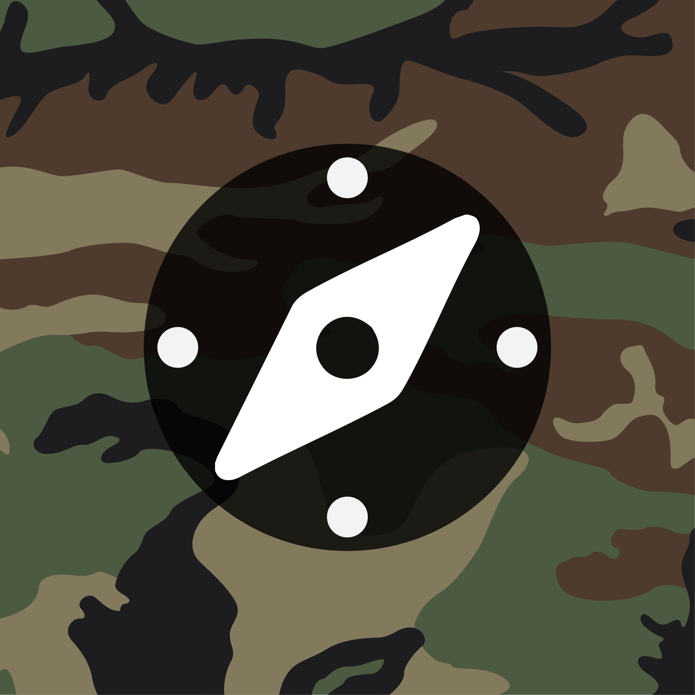
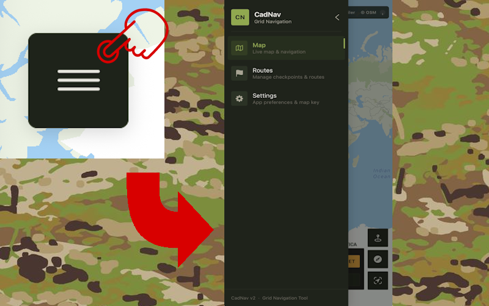
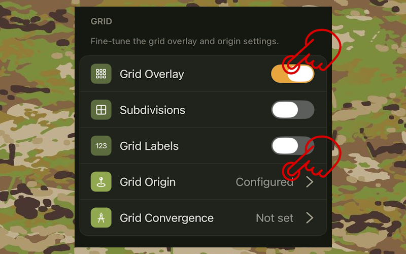
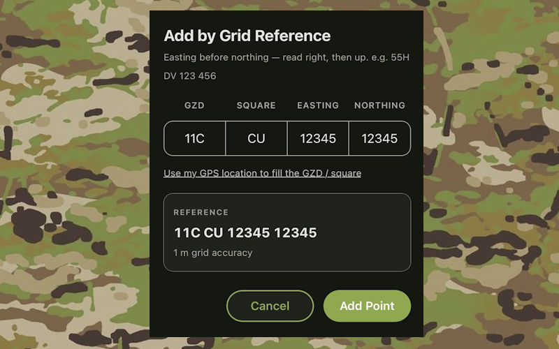
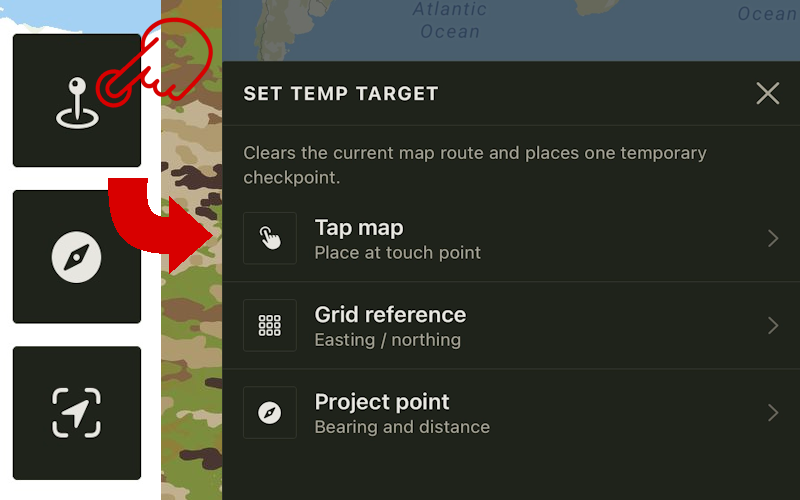
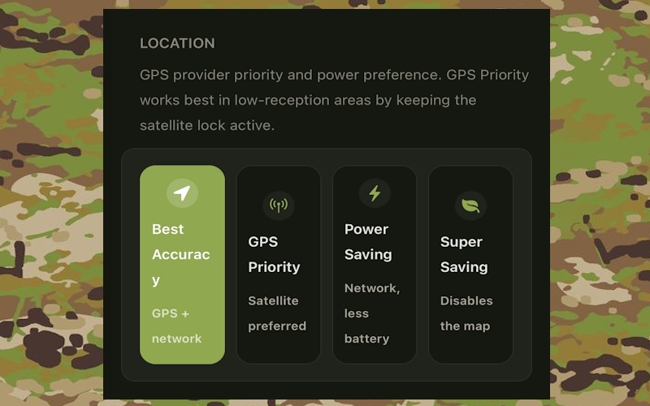
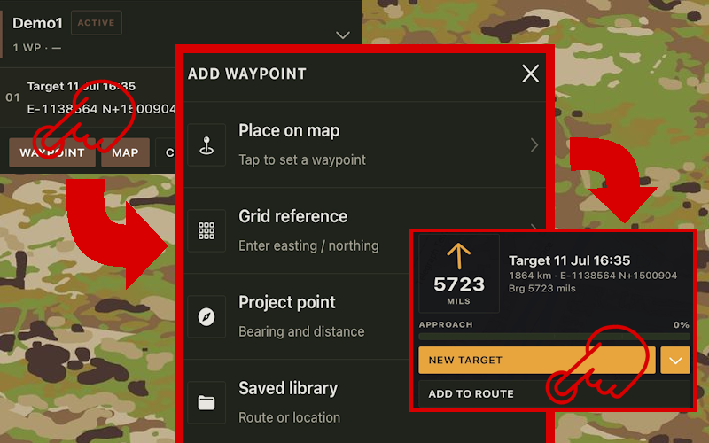
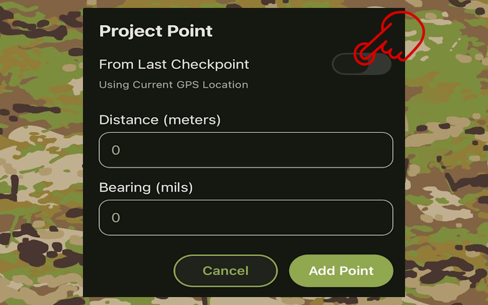
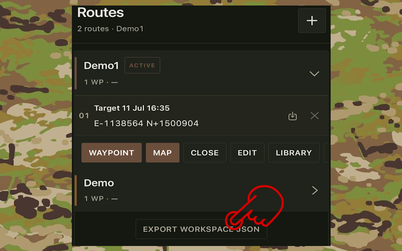
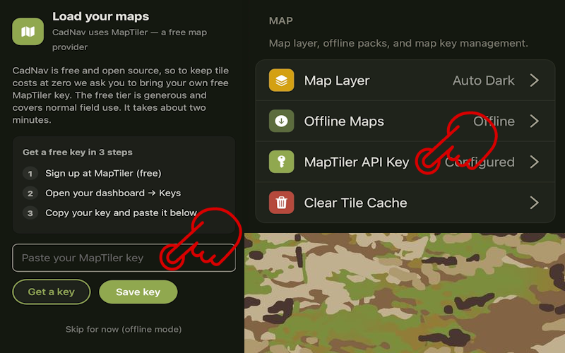

<p align="center">
  
</p>

<h1 align="center">CadNav 2</h1>

<p align="center">
  Cross platform navigation and mapping for field use. Offline first, grid accurate, built with React Native and Expo.
</p>

<p align="center">
  <a href="https://expo.dev"></a>
  <a href="https://reactnative.dev"></a>
  <a href="https://www.typescriptlang.org"></a>
  <a href="https://maplibre.org"></a>
  
  <a href="LICENSE"></a>
</p>

<p align="center">
  <a href="#features">Features</a> &middot;
  <a href="#screenshots">Screenshots</a> &middot;
  <a href="#tech-stack">Tech Stack</a> &middot;
  <a href="#project-structure">Structure</a> &middot;
  <a href="#getting-started">Getting Started</a> &middot;
  <a href="docs/quick-read-index.md">Docs</a>
</p>

---

## Overview

CadNav 2 is a React Native navigation tool designed for cadets, instructors and anyone who needs reliable map navigation without a constant data connection. It pairs [MapLibre GL](https://maplibre.org) with [MapTiler](https://www.maptiler.com) tiles, on device sensors and a Military Grid Reference System (MGRS) workflow to cover planning, field navigation and route sharing.

Built with [Expo](https://expo.dev) and [Expo Router](https://docs.expo.dev/router/introduction/), the app runs on Android and iOS from a single codebase and supports offline map packs, theme customization and QR based sharing.

> Status: Active development. Version 1.0.4. See [app.json](app.json) and [package.json](package.json) for current versions.

## Table of Contents

- [Overview](#overview)
- [Features](#features)
- [Screenshots](#screenshots)
- [Tech Stack](#tech-stack)
- [Project Structure](#project-structure)
- [Getting Started](#getting-started)
- [Configuration](#configuration)
- [Build and Release](#build-and-release)
- [Documentation](#documentation)
- [Contributing](#contributing)
- [License](#license)

## Features

| Area | What it does |
| :--- | :--- |
| **Live navigation** | Real time GPS tracking with follow modes, heading up and north up, plus background location via `expo-location` and `expo-task-manager` |
| **Offline maps** | Downloadable MapTiler packs for use without signal, with progress overlay and local cache management |
| **MGRS grid** | Full MGRS entry in the form `GZD 100km East North`, toggleable overlay, 100m and 1m precision with inaccuracy polygons |
| **Routes and checkpoints** | Workspace routes, saved route library, add by tap, grid reference or projection by bearing and distance |
| **Compass and declination** | Sensor driven compass with World Magnetic Model high resolution correction from bundled `WMMHR.COF` and `WMMHR.json` |
| **Sharing** | One tap QR generation for a single checkpoint or an entire route, scannable by any camera app |
| **Theming** | Light, dark and automatic themes with persistent preferences and consistent design tokens |

Additional capabilities include elevation tracking, grid overlay on web, drawer based navigation and haptics.

## Screenshots

<p align="center">
  
  
  
</p>
<p align="center">
  
  
  
</p>
<p align="center">
  
  
  
</p>

> All images are from `assets/images/manual`. The overlay and grid shots show the core field workflow. See [app/manual.tsx](app/manual.tsx) for the in app guide.

## Tech Stack

| Layer | Technology | Notes |
| :--- | :--- | :--- |
| Framework | [React Native 0.81](https://reactnative.dev) + [Expo 54](https://expo.dev) | File based routing via Expo Router |
| Language | [TypeScript 5.9](https://www.typescriptlang.org) | Strict types in `types/` |
| Maps | [MapLibre GL](https://maplibre.org) + [MapTiler](https://www.maptiler.com) | `@maplibre/maplibre-react-native` 10.4, `maplibre-gl` 5.15 |
| Navigation | [Expo Router](https://docs.expo.dev/router/introduction/) 6.0 | Tabs in `app/(tabs)` |
| State and storage | `@react-native-async-storage/async-storage` + hooks | Keys defined in `constants/storageKeys.ts` |
| Location and sensors | `expo-location`, `expo-sensors`, `expo-task-manager` | GPS, compass, accelerometer, background updates |
| Geometry | [@turf/turf 7.3](https://turfjs.org) | Distance, bearing and projection |
| UI | `expo-blur`, `react-native-reanimated`, `react-native-svg`, `react-native-qrcode-svg` | QR sharing, animations, icons |
| Build | [EAS Build](https://docs.expo.dev/build/introduction/) | Config in [eas.json](eas.json) |

Full dependency list is in [package.json](package.json).

## Project Structure

```text
CadNav2/
├── app/                     # Expo Router screens
│   ├── (tabs)/              # Tab shell: index (map), routes, settings
│   ├── _layout.tsx          # Global providers and error handling
│   ├── manual.tsx           # In app manual
│   ├── import.tsx           # Route import via QR or link
│   └── modal.tsx            # Modal surface
├── components/
│   ├── map/                 # MaplibreMap, compass, grid, declination, HUD
│   ├── routes/              # Route list items and buttons
│   ├── ui/                  # DrawerMenu, StyledButton, ThemeSwitch, Toast
│   └── manual/              # Manual modal helpers
├── hooks/                   # gps, checkpoints, offline-maps, settings, workspace routes
├── constants/               # theme, storageKeys, emojis
├── types/                   # Checkpoint, WorkspaceRoute, SavedRoute
├── lib/                     # geo, colorUtils, maplibreModule
├── assets/
│   ├── icons/               # App icon, adaptive icon, splash
│   ├── images/manual/       # Screenshots used above
│   ├── WMMHR.COF / .json    # Magnetic declination model
│   └── tutorials/           # Reserved for onboarding assets
├── docs/
│   └── quick-read-index.md  # Fastest orientation guide for contributors
├── app.json                 # Expo config
├── eas.json                 # Build profiles
└── tsconfig.json
```

For a curated reading order see [docs/quick-read-index.md](docs/quick-read-index.md). For agent and contributor conventions see `AGENTS.md` if present in your checkout.

## Getting Started

### Prerequisites

- Node.js 18 or higher
- npm or yarn
- Expo CLI: `npm install -g expo-cli`
- Android Studio or Xcode for native runs, or the Expo Go app for quick preview

### Install

```bash
npm install
```

### Environment

```bash
cp .env.example .env.local
# then edit .env.local
```

Required variable:

```text
EXPO_PUBLIC_MAPTILER_BUNDLED_KEY=your_maptiler_key_here
```

Get a key at [cloud.maptiler.com](https://cloud.maptiler.com). The bundled key is used for the 24 hour trial tile access. See [assets/images/manual/manual-api-key-01-signup.png](assets/images/manual/manual-api-key-01-signup.png) through `manual-api-key-04-paste-key.png` for the signup flow.

### Run

| Target | Command |
| :--- | :--- |
| Dev server | `npm start` |
| Android (native) | `npm run android` |
| iOS (native) | `npm run ios` |
| Web | `npm run web` |
| Lint | `npm run lint` |

Expo will print a QR code. Scan it with Expo Go or open the native build.

## Configuration

- **Map provider**: The API key is injected through `components/map/MapTilerKeyProvider.tsx`. Tile style URL construction lives in `components/map/MaplibreMap.tsx` and `MaplibreMap.utils.tsx`.
- **Magnetic declination**: Calculated locally from `assets/WMMHR.COF` and `assets/WMMHR.json` via `components/map/declination.tsx`. No network required for compass correction.
- **Storage**: All persistent data uses AsyncStorage keys from `constants/storageKeys.ts`. Workspace routes use `APP_ROUTES`, saved library uses `cadnav2.routes.v1`.
- **Theming**: Tokens in `constants/theme.ts`, applied through `hooks/use-color-scheme.ts` and themed primitives in `components/themed-text.tsx` and `components/themed-view.tsx`.

## Build and Release

```bash
# Local debug APK
npm run build:android
# which runs: expo prebuild --platform android && cd android && gradlew.bat assembleDebug

# EAS cloud builds
eas build --platform android          # production
eas build --platform android --profile preview
eas build --platform android --profile development
```

Profiles are defined in [eas.json](eas.json). Project ID is set in [app.json](app.json) under `extra.eas.projectId`. For store submission see the `submit` profile in `eas.json` and run `eas submit`.

## Documentation

- [Quick Read Index](docs/quick-read-index.md): where to start in the codebase, map system internals, hooks and data model
- [In app manual](app/manual.tsx): user facing guide rendered inside the app
- [Expo docs](https://docs.expo.dev) and [MapLibre React Native docs](https://maplibre.org/maplibre-react-native/) for platform specifics

## Contributing

Keep changes focused and consistent with the existing codebase:

- Use TypeScript with explicit types from `types/`
- Reuse components in `components/ui` and hooks in `hooks/` rather than duplicating logic
- Keep style values in `constants/theme.ts` and respect light and dark themes
- Run `npm run lint` before opening a pull request

Pull requests that add features should include a short manual note or screenshot where the UI changes.

## License

Licensed under [Apache 2.0](LICENSE). Copyright 2026 Lyren.

See [LICENSE](LICENSE) for the full text.

---

<p align="center">
  <sub>Built for field navigation. If CadNav 2 helps you, consider starring the repo and sharing feedback.</sub>
</p>
